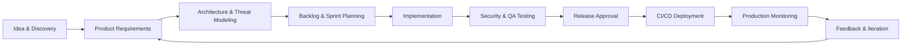
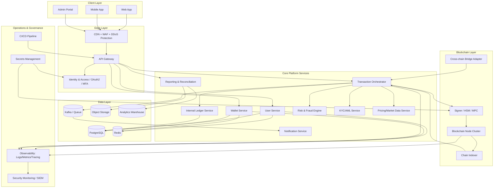
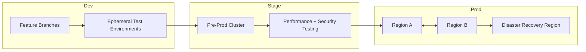
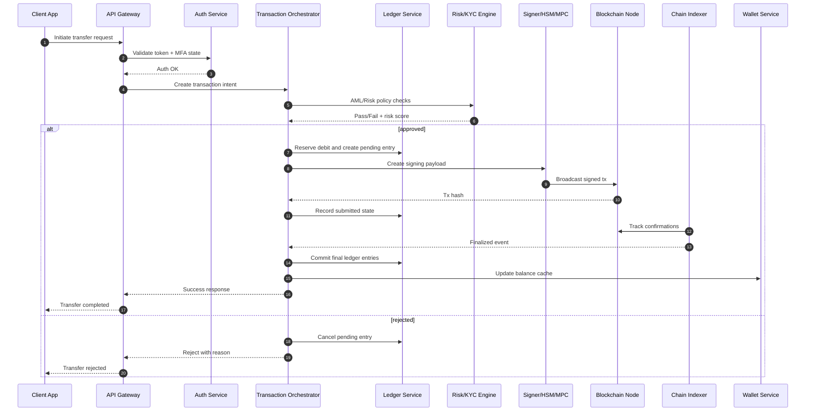
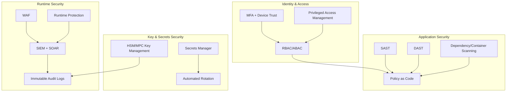

# Cryptocurrency Platform Architecture (Idea to Production)

This document provides a client-ready, end-to-end architecture blueprint for a modern cryptocurrency product platform, from concept and requirements through design, implementation, security, testing, deployment, and operations.

## 1) Platform Vision and Product Lifecycle



### Stages
1. **Idea & Discovery**: Business goals, user personas, market scope, and regulatory target markets.
2. **Requirements**: Wallet, transfers, swap, staking, KYC/AML, audit, and reporting expectations.
3. **Architecture & Threat Modeling**: Trust boundaries, custody model, key management, abuse scenarios.
4. **Implementation**: Agile delivery with secure coding standards.
5. **Testing & Compliance**: Functional, integration, penetration, and compliance checks.
6. **Deployment**: Automated release with canary/blue-green strategies.
7. **Operations**: SRE + Security observability and continuous improvement.

---

## 2) High-Level System Architecture



---

## 3) Reference Environments (Dev → Stage → Prod)



### Environment Standards
- **Infrastructure as Code** (Terraform/Pulumi).
- **GitOps deployment** for auditable release history.
- **Zero-trust networking** across environments.
- **Production parity** in staging for reliable release validation.

---

## 4) Core Transaction Flow (User Transfer)



---

## 5) Security and Compliance Architecture



### Mandatory Controls
- Segregated hot/warm/cold wallet strategy.
- Multi-party authorization for high-value transfers.
- Full audit trail for all sensitive operations.
- Sanctions screening and jurisdiction-based compliance rules.
- Continuous vulnerability and dependency management.

---

## 6) CI/CD and Release Workflow

```mermaid
flowchart LR
    C1[Commit / Pull Request] --> C2[Unit & Integration Tests]
    C2 --> C3[Static Security Scans]
    C3 --> C4[Build Artifacts + SBOM]
    C4 --> C5[Deploy to Staging]
    C5 --> C6[E2E + Performance + Pen Tests]
    C6 --> C7[Release Approval Gate]
    C7 --> C8[Production Deployment]
    C8 --> C9[Post-Deploy Verification]
    C9 --> C10[Monitoring + Auto Rollback if needed]
```



### Pipeline Standards
- Signed artifacts and provenance tracking.
- Required approval gates for production.
- Feature flags to reduce release risk.
- Automated rollback on SLO/SLA breach.

---

## 7) Feature Expansion Framework (New Features)

Use this repeatable path for introducing new platform capabilities:

1. **Feature Ideation**: Define business KPI and user journey.
2. **Architecture Review**: Evaluate service impact, smart contract impact, data flows.
3. **Threat Modeling**: Abuse cases, fraud vectors, and regulatory implications.
4. **Delivery Plan**: API changes, schema evolution, migration strategy.
5. **Validation**: QA, chaos tests, security test, compliance sign-off.
6. **Controlled Launch**: Canary + feature flag + user segment rollout.
7. **Post-Launch Review**: Metrics, incidents, optimization backlog.

---

## 8) Deployment Topology (Kubernetes Example)

```mermaid
flowchart TB
    subgraph Internet
        Users[Users / Partners]
    end

    subgraph Cloud VPC
        LB[Load Balancer + WAF]

        subgraph Kubernetes Cluster
            INGRESS[Ingress Controller]
            APPNS[Application Namespace\n(API, Wallet, Txn, Risk)]
            DATANS[Data Namespace\n(Cache, Message Brokers)]
            OBSNS[Observability Namespace]
        end

        subgraph Managed Services
            DBM[(Managed PostgreSQL)]
            KMS[KMS / HSM Service]
            OBJM[(Object Storage)]
            MON[Managed Monitoring]
        end
    end

    Users --> LB --> INGRESS --> APPNS
    APPNS --> DATANS
    APPNS --> DBM
    APPNS --> KMS
    APPNS --> OBJM
    OBSNS --> MON
```

---

## 9) Client Presentation Checklist

Before sharing with stakeholders, tailor this architecture by adding:
- Specific blockchain targets (e.g., Bitcoin/Ethereum/L2/private chain).
- Custody model (self-custody, custodial, hybrid).
- Jurisdictions and required compliance certifications.
- Planned launch phases (MVP, pilot, scale-up).
- Target SLOs (availability, latency, transaction finality).

This framework provides a standard platform foundation and a clear end-to-end flow from concept to production operations.
